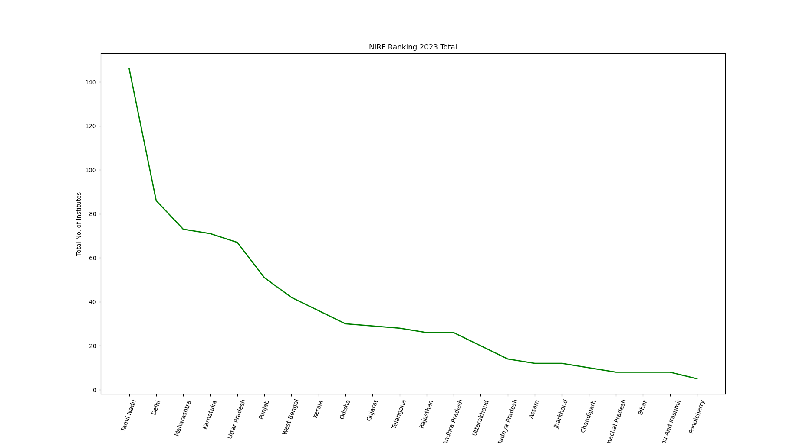

# URL based html table accessing and analysing data

## Description
In this repository, I am web scraping the data through web URLs and will analyse the data using various Data Analytics techniques and will also visualize the data using visualization tools.

## Outputs Folder contains the output of the python script

Following is the image of State wise total number of Instituion in NIRF top 100 Ranking

## You can also contribute in this repository by cloning it. As of now, the main focus of this repository is to do data analysis using data available on internet in the form of html tables.